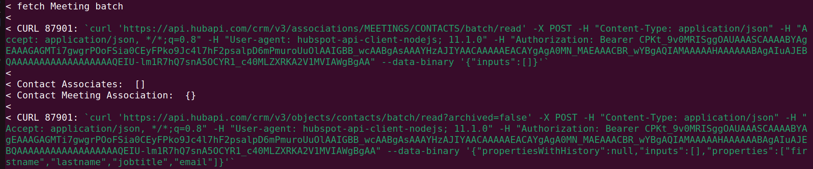

# API Sample Test

## Getting Started

This project requires a newer version of Node. Don't forget to install the NPM packages afterwards.

You should change the name of the ```.env.example``` file to ```.env```.

Run ```node app.js``` OR ```npm run dev``` to get things started. Hopefully the project should start without any errors.

## Explanations

The actual task will be explained separately.

This is a very simple project that pulls data from HubSpot's CRM API. It pulls and processes company and contact data from HubSpot but does not insert it into the database.

In HubSpot, contacts can be part of companies. HubSpot calls this relationship an association. That is, a contact has an association with a company. We make a separate call when processing contacts to fetch this association data.

The Domain model is a record signifying a HockeyStack customer. You shouldn't worry about the actual implementation of it. The only important property is the ```hubspot```object in ```integrations```. This is how we know which HubSpot instance to connect to.

The implementation of the server and the ```server.js``` is not important for this project.

Every data source in this project was created for test purposes. If any request takes more than 5 seconds to execute, there is something wrong with the implementation.

## Notes By Navpreet Singh (Developer)

1. All the **meetings** at the moment have updated date before the lastPulledDate, so create a new meeting or update any of the meetings with marked as **completed** to see the result
2. If you want to see more logs, un-comment the lines with **console.info** in the code
3. If you want to see the **curl** commands in terminal logs like below, then follow the code in [branch](https://github.com/realms-ai/hockeystack_assignment/tree/devCurl)


   
## Brief by Navpreet Singh (Developer)

### Code Quality & Readability
- To improve the code quality and readability,
  1. Have to split the long functions in parts and split the file in multiple files which are working independently w.r.t each other
  2. Write automated test cases w.r.t each class or functions covering 80% or more of the code to make sure that new features are not breaking old functionalities
  3. As Hubspot documentation have similar api names with dynamic changes, we could split it into different **design patterns** 
    - **Factory Method:** To focus on Batch, Basic, Search and so on as a whole
    - **Abstact Factory:** Inherit from above class and build functionality w.r.t different parts like contacts, companies and so on. 
    - **Builder & Prototype**: Inherit from above class and improvise functionality across multiple parts like CRUD in batch, basic, search
    - Above patterns will result in a **Composite** & **bridge** structural design pattern as code grows

### Project Architecture
- As project follows **observer** using webhooks and **command** using CRON jobs behavioral design pattern, 
- it could be designed as a **serverless** or **background jobs in batch** architecture with multiple parts working independently
- parts can communicate with each other via events, SQS, SNS or kafka depending on their criticality and real-time analysis

### Code Performance
- To improve code performance, various things should be kept in mind
  1. Number of Methods or features, which are not independent
    - Spun them in parallel as background jobs or serverless
  2. Number of methods or features, which are dependent
    - Follow the *chain of responsibility* or *iterator* pattern with events such that each component works independently and acknowledge each other via events
  3. DB communication
    - More dependency or connections, use cache to store duplicate data
  4. use of different protocols like GraphQL over REST, HTTP 2.0 over HTTP 1.3 in case of communication between servers only